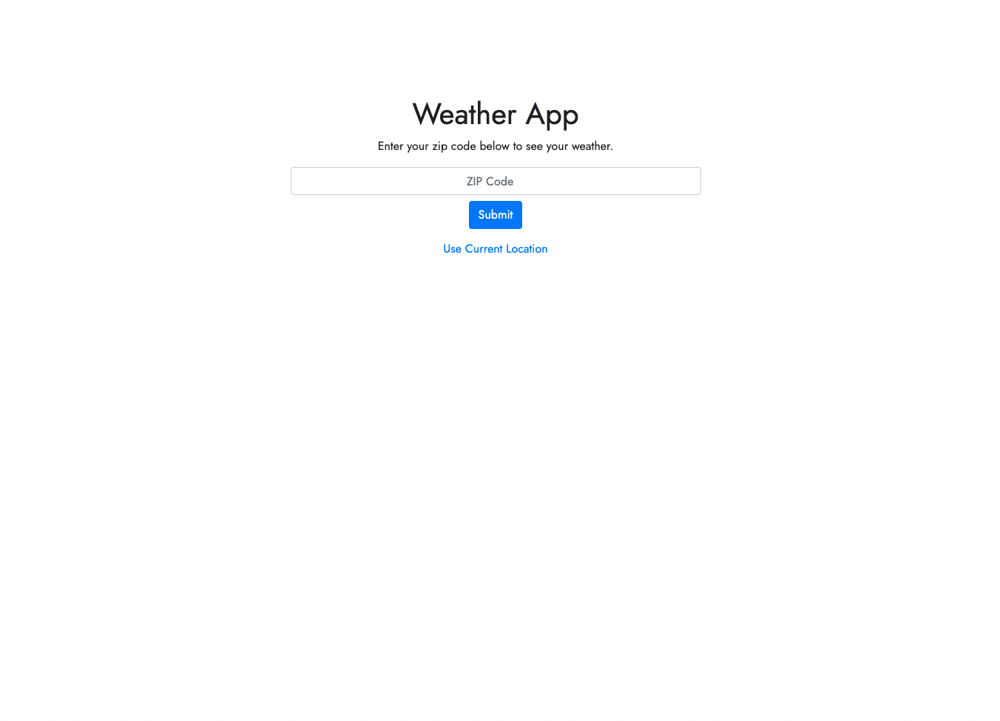
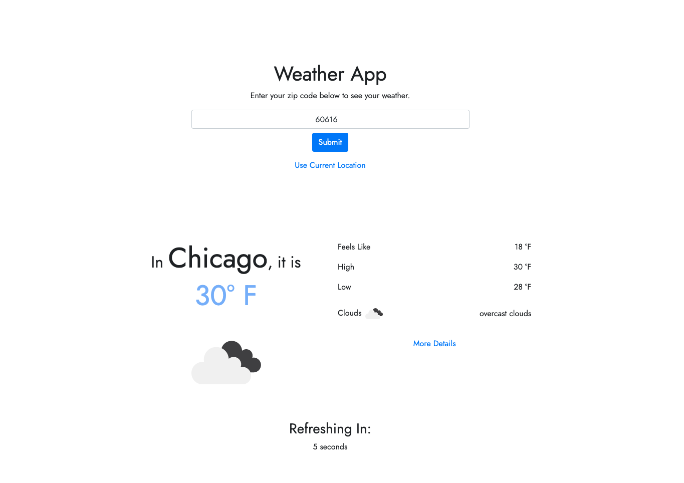
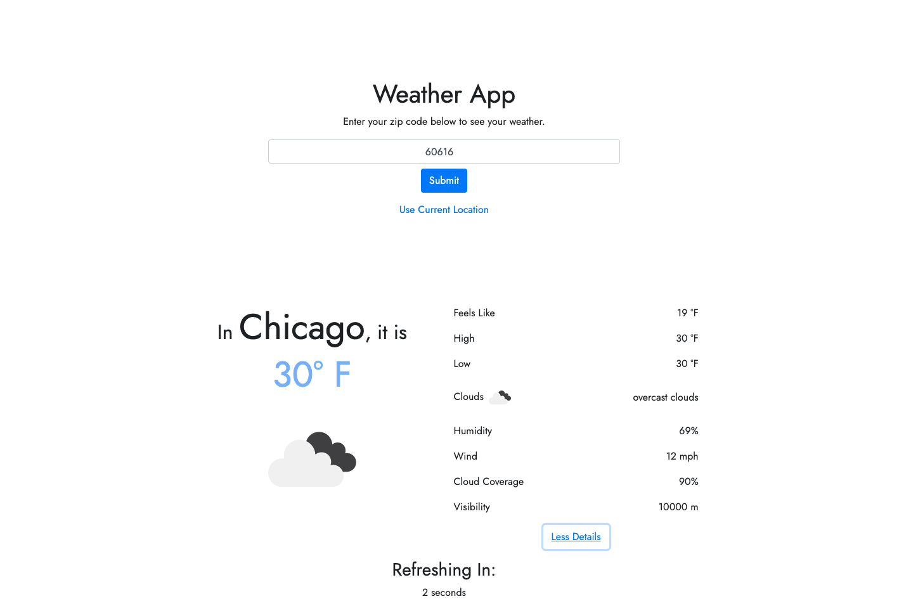

# Overview

Welcome to my minimalist Weather App! This application was built utilizing TypeScript and React Hooks.

A user is able to input their ZIP code or click "Use Current Location" to pull local data by location. To see more advanced weather details, click More Details on the bottom of the page. This app will autoupdate every 10 seconds to ensure the most accurate data is being displayed to a user.

# Screenshots of app

## Changes Made

From the initial file, I connected all components using React and made components functional.
Within the Client component I added a new API freegeoip.app to pull a users location data based on their IP address. Homepage is our parent component that stores the current weather state as well as any error messages we receive and need to display. In Header, I added a ZIP code state as well as more functionality on the submit button to either be triggered by the enter key or clicking the button. Here I also added the error popup if something goes wrong such as inputting an invalid ZIP code. Here I also added the button to Get Current Location using the added API. Within Weather component, I am rendering the weather data as well as allowing the option to show more details. Here we also have our CountDown child which keeps track of seconds using state and will countdown until 0 where it will refresh the data with the current ZIP code. I've also included a Dockerfile with instructions on how to run this using Docker. Thanks for checking out my app and my code!

## Getting Started

$ git clone https://github.com/JordanRaleigh/TandemChallenge.git

$ cd TandemChallenge

$ npm install

$ npm start

Open http://localhost:9001 to view it in the browser.

## Run the app in prod

$ npm run build

## Run the app in Docker

`docker build . -t "image name"`
`docker image ls`
`docker run "image name"`
In new terminal
`docker ps`
`docker exec -it "CONTAINER ID" sh`
`npm start`

# Parking Lot

I would have loved to implement the following to my app given more time

Testing

- Add Mocha and Chai testing frameworks
- Build out unit testing for all functions
- Build integration testing on each broken out component
